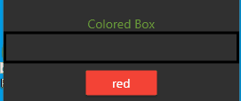
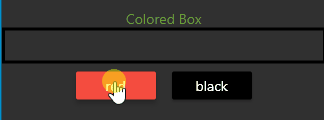
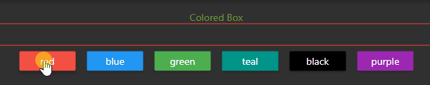

# Flutter State Management

Let's press a button and change the border color of a box.



In some programming languages, you change the color like this:

```
boxColor = newColor
```

In Flutter, to interactively change information such as color, 
pictures, or text on a Flutter screen, you must manage the state.
There are many ways to handle state in Flutter.

The easiest way to manage state is with a stateful widget. You change information, such as color, with a `setState()`.

```dart
setState() {
    boxColor = newColor;
}
```

Although it is easy to set the state with a single `setState()` command, the problem is that you can't 
set the state of one widget from another widget.  For example, if a button exists on screen 1, you can't use
this technique to set the color of screen 2.

You also can't extract the button into a separate class and set the color of a box that exists in another class.
The basic `setState()` technique only works when the widgets are in the widget state, the same file and the same class.
For example, if you have a simple application,
you can put all the buttons inside of the same file, inside the same class.  If all the buttons are in the same
class that a colored box is in, you can directly control the colored box from the button.


## Challenge #1 - Manage state in a single stateful widget



Place both buttons and the colored box in the same class, in the same file.

Use `setState()` in the `onPressed(){}` section of each button.  


## Challenge #2 - Pass Function For State Management 




Adjust the state of a widget from another widget that is in a separate file.

If the button widget is in the same file as the outline box, you can easily use `setState()` to
change the color of the widget.  However, if the widget is in a different file, you must pass 
the state from one widget to another.  There are many ways to pass the state between widgets.


For this challenge create a function in `main.dart` under the `state` section of a stateful widget that
sets the state.  For example, you can call the function, `changeColor`.  The function will then use
setState to change the color.

### Structure

There are two files.

1. color_button.dart
2. main.dart

* Create a raised button template in color_button.dart as a stateless widget
* main.dart contains a stateful widget
* Call the widget from inside main.dart and place in a row

in `main.dart`, the button is called like this:

```dart
ColorButton(
    boxColor: Colors.red,
    colorName: 'red',
    changeColor: changeColor),
```

